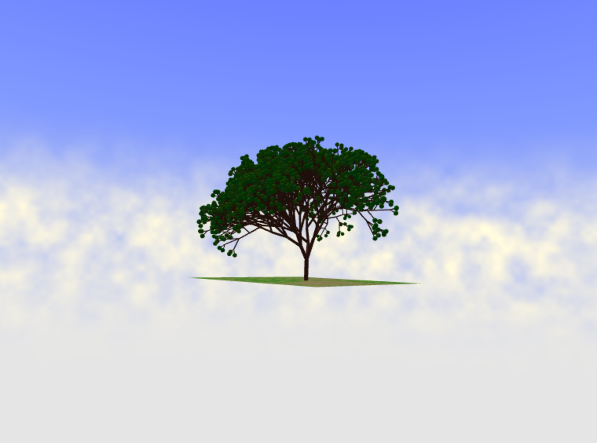

# Homework 4: L-systems

Steven Galban (sgalban)

## Overview
For this assignment, I generated a simple tree with spherical leaves. The timing of this assignment was awkward within my life, so I wasn't able to polish the graphical elements of my scene nearly as much as I would have liked. However, the LSystem itself works well, and the tree looks nice when zoomed out.

## LSystem
The LSystem itself is only used when the scene is first loaded (or the user regenerates it), and therefore does not contribute to any frame drops afterwards. It consists of 8 characters: F, f, [, ], +, -, /, and *.
- F draws a straight cylindrical branch 1.5 units in the direction of the turtle. When expanding, it has a (recursive) 25% chance of becoming even longer
- f is identical to F, but the branch is only 0.5 units, and cannot expand further
- B branches the turtle path. It can either form 2 or 3 more branches, the latter being slightly more likely. Any characters remaining after the string expansion draw the leave spheres.
- The + and - characters reorient the turtle around the Z axis, in opposite directions. The angle is determined by the GUI controls. There is automatically a small random variation to this angle, which is proportional to that defined by the user
- / and * rotate the turtle along the Y axis. The base angle is always 120•, but there is a random variation determined by the input angle
- [ and ] start and end branches, pushing and popping turtles of the stack. These are the only characters whose draw rules are "hardcoded" into the LSystem
As the recursion gets deepeer, the branches also become thinner.

## Parameters
The DAT.GUI controls give the user several options:
- The user can select the base angle to be used in branching, as described above. While I allowed for a wide range of angles to be selected, any angle over 35 causes the tree to look significantly less tree-like. 
- "Iterations" determines how many times the string will be expanded. I find that using 6 or 7 iterations looks decent, and the can still generate quickly. 8 iterations looks even better, although it can take awhile to actually generate (although, not so long that it shoudln't be done). Anything above 8 iterations takes too long on my machine.
- "Axiom" allows the user to input their own axiom. Any characters not in the LSystem's alphabet will be ignored, and poorly nested brackets are not handled. The default axiom is FB, but I find that FFF[+B][-B] looks pretty nice as well.
- In order for any changes to take effect, the user must press the "Regenerate" button

## Other Features
I added a small plane to act as the ground, and colored it with grass and patches of dirt using simple FBM.
The background uses the flat shader and finds the direction of the fragment ray in world space, similarly to the raymarching assignments. Using these rays, a cloudy sky is generated using more FBM. These clouds are animated using u_Time.

## Demo
https://sgalban.github.io/hw04-l-systems/